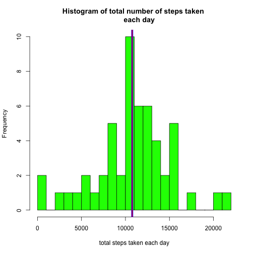
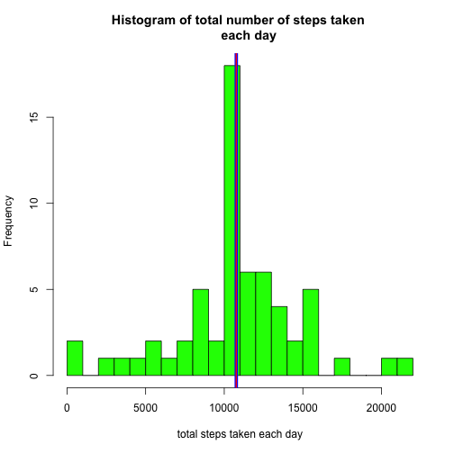
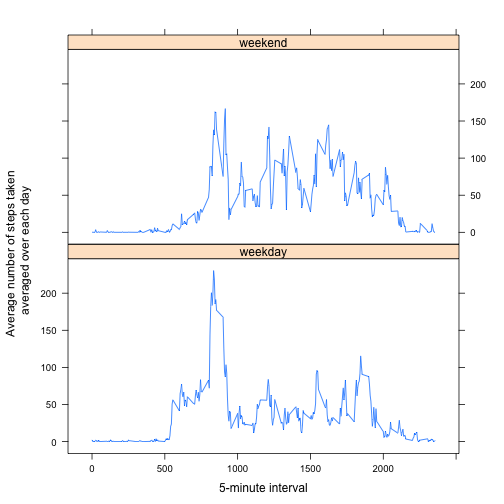

# Reproducible Research: Peer Assessment 1

## Synopsis

This is a report that uses the data in the activity.zip file, which contains - 
once unzipped - the file activity.csv. This .zip file is present in this Github 
Repository, make sure you unzip it in your working directory before running the 
program.
This file contains personal activity monitoring data collected at 5 minute 
intervals throughout the day during a period of 2 months (Oct. and Nov. 2012) 
from an anonymous individual and includes the number of steps taking in 5 minute 
intervals each day.


```r
sessionInfo()
```

```
## R version 3.1.1 (2014-07-10)
## Platform: x86_64-apple-darwin13.1.0 (64-bit)
## 
## locale:
## [1] en_US.UTF-8/en_US.UTF-8/en_US.UTF-8/C/en_US.UTF-8/en_US.UTF-8
## 
## attached base packages:
## [1] stats     graphics  grDevices utils     datasets  methods   base     
## 
## other attached packages:
## [1] plyr_1.8.1      lattice_0.20-29 knitr_1.8       lubridate_1.3.3
## [5] stringr_0.6.2  
## 
## loaded via a namespace (and not attached):
## [1] digest_0.6.4   evaluate_0.5.5 formatR_1.0    grid_3.1.1    
## [5] markdown_0.7.4 memoise_0.2.1  mime_0.2       Rcpp_0.11.3   
## [9] tools_3.1.1
```

## Loading and preprocessing the data

- Loading the data  


```r
if(!file.exists("./activity.csv")){
    fileUrl = "https://d396qusza40orc.cloudfront.net/repdata%2Fdata%2Factivity.zip"
    download.file(fileUrl, "temp.zip", method ="curl", mode="wb")
    unzip ("temp.zip")
}
actdf<-read.csv("./activity.csv", header = TRUE, stringsAsFactors=FALSE)
```

- Changing the date column to a date format and change the interval to time
for reference purposes as we keep the intervals as the values for the x-axis 
in ts plots.


```r
if(!require(stringr)){
    install.packages("stringr")
    library(stringr)
}

actdf$date<-as.Date(actdf$date, "%Y-%m-%d")
actdf$time<-as.character(actdf$interval)
actdf$time<-str_pad(actdf$time, width=4, side="left",pad="0")
actdf$time<-str_c(str_sub(actdf$time,1,2),":",str_sub(actdf$time,-2))
actdf$newtime<-strptime(paste(actdf$date, actdf$time, sep= " "), "%Y-%m-%d %H:%M")
```

## What is mean total number of steps taken per day?  

For the first part of this report the missing values are ignored.  


```r
if(!require(stats)){
    install.packages("stats")
    library(stats)
    }
if(!require(plyr)){
    install.packages("plyr")
    library(plyr)
    }

totalbyday<-aggregate(actdf$steps, by = list(date=actdf$date), FUN = sum)
colnames(totalbyday)[2]<-"totalSteps"

mean <- round(mean(totalbyday$totalSteps,na.rm = TRUE),0)
median <- median(totalbyday$totalSteps,na.rm = TRUE)

hist(totalbyday$totalSteps, main = "Histogram of total number of steps taken 
     each day", xlab = "total steps taken each day", col = "green", breaks =20)
abline(v=mean, lwd = 5, col = "blue")
abline(v=median, lwd = 2, col = "red")
```

 

We calculate and report the mean and median total number of steps taken per day, after 
calculating the mean number of steps per day, which is depicted in green on the histogram.
The mean total number of steps taken per day is 1.0766 &times; 10<sup>4</sup>and is depicted in blue.
The median total number of steps taken per day is 10765 and is depicted in red.  
The mean and median values are not significantly different, which means that the data is 
evenly divided around the mean. 


## What is the average daily activity pattern?

Now we are also curious as to what the average daily activity pattern looks like. We 
therefore calculate the averages of the different intervals across all days. The result 
is displayed in the following time series plot of the 5-minute interval (x-axis) and the average 
number of steps taken, averaged across all days (y-axis)


```r
avgbyinterval<-aggregate(actdf$steps, 
                         by = list(interval=actdf$interval), 
                         FUN = mean, na.rm=TRUE)
colnames(avgbyinterval)[2]<-"avgSteps"
par(mgp=c(2,0.5,0))
plot(avgbyinterval$interval, avgbyinterval$avgSteps,type = "l", 
     main="Time Series plot \n of average number of steps taken per 5-minute time interval", 
     xlab= "5-minute interval", ylab = "Average number of steps taken \n averaged over each day" )
```

 


```r
intervalmoststeps<-avgbyinterval[which.max(avgbyinterval$avgSteps),1]
```

The 5-minute interval, on average across all the days in the dataset, which contains
the maximum number of steps is 835.


## Imputing missing values

In the dataset there are a number of days/intervals where there are missing values
(coded as NA). NA presence of missing days may introduce bias into some calculations 
or summaries of the data.


```r
numna<-sum(is.na(actdf$steps))
daysmissing<- numna/nrow(avgbyinterval)
```

There are 2304 records with missing values in the dataset, which means that no data was 
recorded during roughly 8 of days.

That is a significant number of missing values. In order to get a more correct representation
of the data, we will create a new dataset in which we will replace all of the missing values 
with the mean value for that interval.


```r
actdf$id<-1:nrow(actdf)
newactdf<-merge(actdf, avgbyinterval, by = "interval")
newactdf<-newactdf[order(newactdf$id),]
actdf$id<-NULL
newactdf$id<-NULL

for (i in 1:nrow(newactdf)){
  if (is.na(newactdf[i,"steps"])){
   newactdf[i,"steps"]<-newactdf[i,"avgSteps"]
  }
}
```


```r
newtotalbyday<-aggregate(newactdf$steps, by = list(date=newactdf$date), FUN = sum)
colnames(newtotalbyday)[2]<-"totalSteps"
mean <- round(mean(newtotalbyday$totalSteps,na.rm = TRUE),0)
median <- round(median(newtotalbyday$totalSteps,na.rm = TRUE),0)
hist(newtotalbyday$totalSteps, main = "Histogram of total number of steps taken 
     each day", xlab = "total steps taken each day", col = "green", breaks =20)
abline(v=mean, lwd = 5, col = "blue")
abline(v=median, lwd = 2, col = "red")
```

 


We calculate and report the mean and median total number of steps taken per day, after 
calculating the mean number of steps per day, which is depicted in green on the histogram.
The mean total number of steps taken per day is 1.0766 &times; 10<sup>4</sup>and is depicted in blue.
The median total number of steps taken per day is 1.0766 &times; 10<sup>4</sup> and is depicted in red.  
The mean and median values are not significantly different, which means that the data is 
evenly divided around the mean, once again. 

What is different however is the frequency of the bin where the mean and median are situated. 
It has increased by 8 which is logical, as there were 8 days where the data were missing. As 
we have replaced the data with the mean values, it means that the mean bin has increased by 
this amount of days.


## Are there differences in activity patterns between weekdays and weekends?

To find out if there is any difference in activity pattern between the weekdays
and weekends, we added a factor variable to the dataset with two levels --"weekday" 
and "weekend". Based on this variable, we recalculated the total number of steps 
taken, averaged across all weekday days or weekend days. 


```r
newactdf$day<-weekdays(newactdf$date)
newactdf$weekendweek<-rep(1:2,nrow(newactdf)/2)
newactdf$weekendweek<-factor(newactdf$weekendweek, labels=c("weekday","weekend"))

for (i in 1:nrow(newactdf)) {
        if(newactdf[i,"day"] == "Saturday") {
                newactdf[i,"weekendweek"] <- "weekend"
        } else {
                 if(newactdf[i,"day"] == "Sunday") {
                         newactdf[i,"weekendweek"] <- "weekend"
                         }
                 else {
                         newactdf[i, "weekendweek"] <- "weekday"
                 }
               
        }
}
```

The panel plot below contains a time series plot of the 5-minute interval(x-axis) 
and the average number of steps taken, averaged across all weekday days or weekend days
(y-axis). 


```r
if(!require(lattice)){
    install.packages("lattice")
    library(lattice)
}
abiww<-ddply(newactdf, c("interval","weekendweek"), summarize, abi = mean(steps,na.rm = TRUE))
xyplot (abiww$abi~abiww$interval | abiww$weekendweek,layout = c(1,2), type='l', 
        xlab="5-minute interval", 
        ylab = "Average number of steps taken \n averaged over each day")
```

 

From this plot you can conclude, that during weekdays, activity increased earlier in 
the day, with a peak when this individual probably prepared for the day, with a decline during
normal working hours, a slight peaking again around dinner time and a steadying off at night.
The weekends looked slightly different on average, the data increased later in the day, with 
more peaks throughout the day, which probably indicates to an active lifestyle. 
